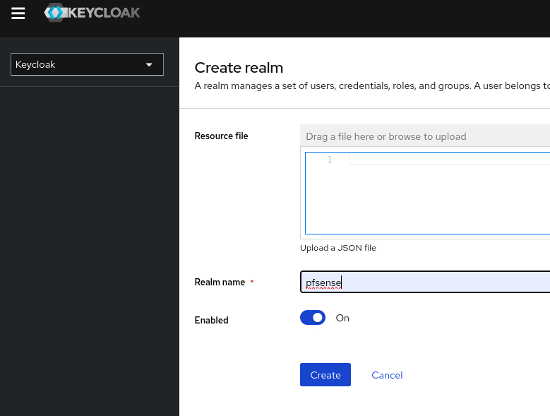
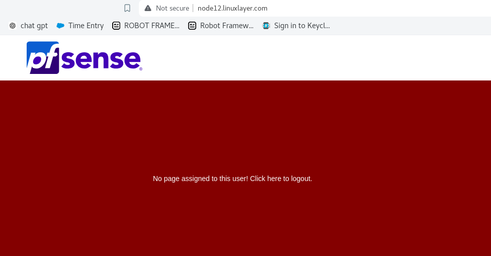

<h1><center>Freeradius Installation with PAM oauth and Intigration with Keycloak</center></h1>

----

### Requirement:- 

  - Freeradius Installation with PAM oauth and Configure Keycloak backend for user authentication and intigrate in pfsense.
----
### Prerequisite:- 

  - Keycloak container image v24.0.4
  - freeradius container image latest
  - Pfsense deployed with basic configuration

----

### Environment 


  |  Component  | Version |
  |:-------------:|:-------------:|
  |    OS| RHEL 8.9   | 
  |  Podman| 4.6.1     |
  |Freeradius| 3.2.3|
  |Keycloak| 24.0.4 |

  > - Note:- Firewall and selinux stopped on server  
  > - No volumes attached for persistent data 

----

#### Deployment and configuration 

##### Keycloak 
  
Step 1 - Pull the images of keycloak and freeradius
  ```
  [root@node44 ~]# podman ps -a 
  CONTAINER ID  IMAGE       COMMAND     CREATED     STATUS      PORTS       NAMES
  
  [root@node44 ~]# podman images
  REPOSITORY  TAG         IMAGE ID    CREATED     SIZE
  [root@node44 ~]#
  
  [root@node44 ~]# podman pull quay.io/keycloak/keycloak
  Trying to pull quay.io/keycloak/keycloak:latest...
  Getting image source signatures
  Copying blob b97da05de8fb done  
  Copying blob 0007ef99466f done  
  Copying blob 068c30ae12a6 done  
  Copying blob ddf997398e20 done  
  Copying config c8bfd0bc98 done  
  Writing manifest to image destination
  c8bfd0bc98f00d67d22fda7ec4583534e762dd27df47f02491cbc4663a0f563f
  
  [root@node44 ~]# podman pull docker.io/freeradius/freeradius-server 
  Trying to pull docker.io/freeradius/freeradius-server:latest...
  Getting image source signatures
  Copying blob 2942e86fc976 done  
  Copying blob dbf6a9befcde done  
  Copying blob 36f5488f891c done  
  Copying blob 4fbe7fb63e70 done  
  Copying blob 2942e86fc976 done  
  Copying config a5c7e08293 done  
  Writing manifest to image destination
  a5c7e0829368ec5d2f4dddae3b28ff701221abcc3f3421ea4e8ccd3e1b989983
  
  [root@node44 ~]# podman images
  REPOSITORY                              TAG         IMAGE ID      CREATED        SIZE
  quay.io/keycloak/keycloak               latest      c8bfd0bc98f0  2 weeks ago    462 MB
  docker.io/freeradius/freeradius-server  latest      a5c7e0829368  12 months ago  245 MB
  [root@node44 ~]# 
  
  ```
Step 2 - Run the keycloak container 
  ```
  [root@node44 ~]# podman run -dit -p 80:8080 -e KEYCLOAK_ADMIN=admin -e KEYCLOAK_ADMIN_PASSWORD=admin --name keyclock  quay.io/keycloak/keycloak start-dev
  dc9fb81f200c4535afebeb7096e5a4736cf7e3839c3ec1377b3b5cfd0349b5b0
  
  [root@node44 ~]# podman ps 
  CONTAINER ID  IMAGE                             COMMAND     CREATED        STATUS        PORTS                 NAMES
  dc9fb81f200c  quay.io/keycloak/keycloak:latest  start-dev   4 seconds ago  Up 4 seconds  0.0.0.0:80->8080/tcp  keyclock
  [root@node44 ~]#
  ```
Step 3 - Login in keycloak and create a new realm
  
  
Step 4 - Enable the Unmanaged Attributes in realm settings
  
Step 5 - Create the Client
  
  
  

Step 4 - Create the User in keycloak
   
 - Set the credentials for the user 
   
----

###### Freeradius Deployment and configuration 

> - Get the code from GitHub repo https://github.com/thomasdarimont/keycloak-freeradius-demo.git and make the required changes or extract the shared tar 
> - Changes required - if code download from GitHub remark added by sign "<<<"

```
[root@node44 ~]# cd /tmp/
[root@node44 tmp]# ll
total 0
[root@node44 tmp]# git clone https://github.com/thomasdarimont/keycloak-freeradius-demo.git
Cloning into 'keycloak-freeradius-demo'...
remote: Enumerating objects: 43, done.
remote: Total 43 (delta 0), reused 0 (delta 0), pack-reused 43
Receiving objects: 100% (43/43), 5.25 MiB | 623.00 KiB/s, done.
Resolving deltas: 100% (13/13), done.
[root@node44 tmp]# cd keycloak-freeradius-demo/
[root@node44 keycloak-freeradius-demo]# ls
keycloak  radius  readme.md
[root@node44 keycloak-freeradius-demo]# cd radius/
[root@node44 radius]# ls
build.sh  clients.conf  Dockerfile  pam  pam-exec-oauth2  pam-exec-oauth2.yaml  readme.md  run.sh  test-login-fail.sh  test-login-ok.sh  test.txt
[root@node44 radius]# ll
total 10944
-rwxr-xr-x 1 root root      171 May 28 23:46 build.sh
-rw-r--r-- 1 root root     7729 May 28 23:46 clients.conf
-rw-r--r-- 1 root root     1562 May 28 23:46 Dockerfile   <<< Docker file to build the images
drwxr-xr-x 2 root root       21 May 28 23:46 pam
-rwxr-xr-x 1 root root 11165656 May 28 23:46 pam-exec-oauth2 <<< PAM file that will execute for auth 
-rw-r--r-- 1 root root      395 May 28 23:46 pam-exec-oauth2.yaml <<< oauth Config file for PAM module 
-rw-r--r-- 1 root root     2675 May 28 23:46 readme.md
-rwxr-xr-x 1 root root      157 May 28 23:46 run.sh
-rwxr-xr-x 1 root root       99 May 28 23:46 test-login-fail.sh
-rwxr-xr-x 1 root root       98 May 28 23:46 test-login-ok.sh
-rw-r--r-- 1 root root      377 May 28 23:46 test.txt
[root@node44 radius]# 
```

```
[root@node44 radius]# cat Dockerfile 
FROM freeradius/freeradius-server:3.0.18 <<< Change the version to the latest

ENV OAUTH_PAM_PREFIX /opt/pam-exec-oauth2
ENV RADIUS_SECRET bubu123 <<< change the secret according to you
ENV DEBIAN_FRONTEND noninteractive

# Note those tools are just used for debugging and could be removed
RUN apt-get update && \
 apt-get install -y less <<< Add more packages to install

# Install OAuth2 PAM Module
# --chown=freerad:freerad 
COPY --chown=freerad:freerad pam-exec-oauth2 $OAUTH_PAM_PREFIX/pam-exec-oauth2
COPY --chown=freerad:freerad pam-exec-oauth2.yaml $OAUTH_PAM_PREFIX/pam-exec-oauth2.yaml

COPY --chown=freerad:freerad clients.conf /etc/freeradius/clients.conf

# Add OAuth2 PAM Module as allowed login mechanism
RUN echo "Enable PAM module" && \
 cd /etc/freeradius/mods-enabled && \
 ln -s ../mods-available/pam pam && \
#<<< Add below 3 lines to create log dir. and file so that pam module can run 
#    mkdir -p /var/log/freeradius/ && \
#    touch /var/log/freeradius/pam.log && \
#    chmod 777 /var/log/freeradius/pam.log && \
 cd / && \
 echo "Enable PAM authentication" && \
 sed -i 's/#\s*pam/  pam/' /etc/freeradius/sites-enabled/
 default && \
 sed -i 's/#\s*pam/  pam/' /etc/freeradius/sites-enabled/inner-tunnel

RUN echo "# Instruct FreeRADIUS to use PAM to authenticate users"  >> /etc/freeradius/users && \
 echo "DEFAULT Auth-Type := PAM" >> /etc/freeradius/users && \
 sed -i "s/\s*secret\s*=\s*testing123/secret = $RADIUS_SECRET/" /etc/freeradius/clients.conf && \
#    echo "Add custom freeradius client" && \
#    echo "client client144x {\n  ipaddr = 144.0.0.0/8\n  secret = $RADIUS_SECRET\n}" >> /etc/freeradius/clients.conf && \
 echo "Configuring pam-exec-oauth2 PAM module" && \
 chmod 755 $OAUTH_PAM_PREFIX/pam-exec-oauth2 && \
 chmod 600 $OAUTH_PAM_PREFIX/pam-exec-oauth2.yaml

COPY pam/radiusd /etc/pam.d/radiusd
[root@node44 radius]#
```
> - Note - In pam-exec-oauth2.yaml  you have to change the parameter according to your keycloak 

- Default file:- 
  ```
  [root@node44 radius]# cat pam-exec-oauth2.yaml 
  {
   client-id: "svc-radius-auth",
   client-secret: "8721e497-4a18-40a2-822f-a847c6d17632",
   redirect-url: "urn:ietf:wg:oauth:2.0:oob",
   scopes: ["email"],
   endpoint-auth-url: "http://localhost:8180/auth/realms/radiusdemo/protocol/openid-connect/auth",
   endpoint-token-url: "http://localhost:8180/auth/realms/radiusdemo/protocol/openid-connect/token",
   username-format: "%s",
  }
  [root@node44 radius]#
  ```
- Modified file according to keycloak and freeradius (scopes) 

  ```
  [root@node44 radius]# cat ~/keycloak-freeradius-demo/radius/pam-exec-oauth2.yaml 
  {
   client-id: "pfsense-client",
   client-secret: "Bk8NjFhJv0e1ct842XZY82EDILbVbUSx",
   redirect-url: "urn:ietf:wg:oauth:2.0:oob",
   scopes: ["email"],
   endpoint-auth-url: "http://node44.linuxlayer.com/realms/pfsense/protocol/openid-connect/auth",
   endpoint-token-url: "http://node44.linuxlayer.com/realms/pfsense/protocol/openid-connect/token",
   username-format: "%s",
  }
  [root@node44 radius]#
  ```

----

- Hare I'm going with tar file which have all changes there 

Step 1. - untar the tar file 

  ```
  [root@node44 ~]# ll
  total 10064
  drwxr-xr-x. 3 root root       17 May  7 12:57 go
  drwxr-xr-x. 9 root root     4096 May 15 12:07 google-cloud-sdk
  -rw-r--r--  1 root root 10300096 May 28 17:39 keycloak-freeradius-demo.tar.gz
  [root@node44 ~]# tar -xf keycloak-freeradius-demo.tar.gz 
  [root@node44 ~]# ll
  total 10064
  drwxr-xr-x. 3 root root       17 May  7 12:57 go
  drwxr-xr-x. 9 root root     4096 May 15 12:07 google-cloud-sdk
  drwxr-xr-x  5 root root       83 Apr 25 13:55 keycloak-freeradius-demo
  -rw-r--r--  1 root root 10300096 May 28 17:39 keycloak-freeradius-demo.tar.gz
  [root@node44 ~]#
  ```

Step 2 - Modify the pam-exec-oauth2.yaml file according to the keycloak configuration
  ```
  [root@node44 ~]# cd keycloak-freeradius-demo/radius/
  [root@node44 radius]# vim pam-exec-oauth2.yaml 
  [root@node44 radius]# cat pam-exec-oauth2.yaml 
  {
   client-id: "pfsense-client",
   client-secret: "Bk8NjFhJv0e1ct842XZY82EDILbVbUSx",
   redirect-url: "urn:ietf:wg:oauth:2.0:oob",
   scopes: ["email"],
   endpoint-auth-url: "http://node44.linuxlayer.com/realms/pfsense/protocol/openid-connect/auth",
   endpoint-token-url: "http://node44.linuxlayer.com/realms/pfsense/protocol/openid-connect/token",
   username-format: "%s",
  }
  [root@node44 radius]#
  ```
Step 3 - Build the freeradius container image 

- Dockerfile for reffrence 
  ```
  [root@node44 radius]# cat Dockerfile 
  FROM docker.io/freeradius/freeradius-server
  
  ENV OAUTH_PAM_PREFIX /opt/pam-exec-oauth2
  ENV RADIUS_SECRET admin
  ENV DEBIAN_FRONTEND noninteractive
  
  # Note those tools are just used for debugging and could be removed
  RUN apt-get update && \
   apt-get install -y less vim golang-go 
  
  # Install OAuth2 PAM Module
  # --chown=freerad:freerad 
  COPY --chown=freerad:freerad pam-exec-oauth2 $OAUTH_PAM_PREFIX/pam-exec-oauth2
  COPY --chown=freerad:freerad pam-exec-oauth2.yaml $OAUTH_PAM_PREFIX/pam-exec-oauth2.yaml
  
  COPY --chown=freerad:freerad clients.conf /etc/freeradius/clients.conf
  
  # Add OAuth2 PAM Module as allowed login mechanism
  RUN echo "Enable PAM module" && \
   cd /etc/freeradius/mods-enabled && \
   ln -s ../mods-available/pam pam && \
   mkdir -p /var/log/freeradius/ && \
   touch /var/log/freeradius/pam.log && \
   chmod 777 /var/log/freeradius/pam.log && \
   cd / && \
   echo "Enable PAM authentication" && \
   sed -i 's/#\s*pam/  pam/' /etc/freeradius/sites-enabled/default && \
   sed -i 's/#\s*pam/  pam/' /etc/freeradius/sites-enabled/inner-tunnel
  
  RUN echo "# Instruct FreeRADIUS to use PAM to authenticate users"  >> /etc/freeradius/users && \
   echo "DEFAULT Auth-Type := PAM" >> /etc/freeradius/users && \
   sed -i "s/\s*secret\s*=\s*testing123/secret = $RADIUS_SECRET/" /etc/freeradius/clients.conf && \
  #    echo "Add custom freeradius client" && \
  #    echo "client client144x {\n  ipaddr = 144.0.0.0/8\n  secret = $RADIUS_SECRET\n}" >> /etc/freeradius/clients.conf && \
   echo "Configuring pam-exec-oauth2 PAM module" && \
   chmod 755 $OAUTH_PAM_PREFIX/pam-exec-oauth2 && \
   chmod 600 $OAUTH_PAM_PREFIX/pam-exec-oauth2.yaml
  
  COPY pam/radiusd /etc/pam.d/radiusd
  [root@node44 radius]# 
  ```
- Build the container image
  ```
  [root@node44 radius]# podman build -f Dockerfile -t my-radius-images
  STEP 1/11: FROM docker.io/freeradius/freeradius-server
  STEP 2/11: ENV OAUTH_PAM_PREFIX /opt/pam-exec-oauth2
  --> 302a2a93dbbf
  STEP 3/11: ENV RADIUS_SECRET admin
  --> 5f7c60f9130a
  STEP 4/11: ENV DEBIAN_FRONTEND noninteractive
  --> ed465566450d
  STEP 5/11: RUN apt-get update &&     apt-get install -y less vim golang-go 
  <<<Output ommited>>>
  --> 5049ccb02805
  STEP 6/11: COPY --chown=freerad:freerad pam-exec-oauth2 $OAUTH_PAM_PREFIX/pam-exec-oauth2
  --> 1fd5f3d27e74
  STEP 7/11: COPY --chown=freerad:freerad pam-exec-oauth2.yaml $OAUTH_PAM_PREFIX/pam-exec-oauth2.yaml
  --> bb2588372a06
  STEP 8/11: COPY --chown=freerad:freerad clients.conf /etc/freeradius/clients.conf
  --> 4146fb00c22e
  STEP 9/11: RUN echo "Enable PAM module" &&     cd /etc/freeradius/mods-enabled &&     ln -s ../mods-available/pam pam &&     mkdir -p /var/log/freeradius/ &&     touch /var/log/freeradius/pam.log &&     chmod 777 /var/log/freeradius/pam.log &&     cd / &&     echo "Enable PAM authentication" &&     sed -i 's/#\s*pam/  pam/' /etc/freeradius/sites-enabled/default &&     sed -i 's/#\s*pam/   pam/' /etc/freeradius/sites-enabled/inner-tunnel
  Enable PAM module
  Enable PAM authentication
  --> 37552705cb10
  STEP 10/11: RUN echo "# Instruct FreeRADIUS to use PAM to authenticate users"  >> /etc/freeradius/users &&     echo "DEFAULT Auth-Type := PAM" >> /etc/freeradius/users &&     sed -i "s/\s*secret\s*=\s*testing123/secret = $RADIUS_SECRET/" /etc/freeradius/clients.conf &&     echo "Configuring pam-exec-oauth2 PAM module" &&     chmod 755 $OAUTH_PAM_PREFIX/pam-exec-oauth2 &&     chmod 600 $OAUTH_PAM_PREFIX/pam-exec-oauth2.yaml
  Configuring pam-exec-oauth2 PAM module
  --> 7d6aa07a93f7
  STEP 11/11: COPY pam/radiusd /etc/pam.d/radiusd
  COMMIT my-radius-images
  --> c2e5c86f37a3
  Successfully tagged localhost/my-radius-images:latest
  c2e5c86f37a3c895e40a7aacdb99a49be2162b3ef30806081f693eb84392c917
  [root@node44 radius]#
  ```

  ```
  [root@node44 radius]# podman images
  REPOSITORY                              TAG         IMAGE ID      CREATED        SIZE
  localhost/my-radius-images              latest      c2e5c86f37a3  3 minutes ago  1.03 GB
  quay.io/keycloak/keycloak               latest      c8bfd0bc98f0  2 weeks ago    462 MB
  docker.io/freeradius/freeradius-server  latest      a5c7e0829368  12 months ago  245 MB
  [root@node44 radius]#
  ```
Step 4. - Run the freeradius container 

  ```
  [root@node44 radius]# podman run -dit --net=host --name my-radius -p 1812-1813:1812-1813/udp localhost/my-radius-images -X 
  Port mappings have been discarded as one of the Host, Container, Pod, and None network modes are in use
  ba92edbf1a895a9cf8591cfd8b33fef2bae14071da4cd66cf77f8d6284d1446c
  [root@node44 radius]#
  
  [root@node44 radius]#podman ps 
  CONTAINER ID  IMAGE                              COMMAND     CREATED            STATUS            PORTS                 NAMES
  dc9fb81f200c  quay.io/keycloak/keycloak:latest   start-dev   About an hour ago  Up About an hour  0.0.0.0:80->8080/tcp  keyclock
  ba92edbf1a89  localhost/my-radius-images:latest  -X          5 seconds ago      Up 5 seconds                            my-radius
  [root@node44 radius]#
  ```
---
### Testing
##### Login test of keycloak local user using curl / radtest command

- Get the token using curl command from the keycloak
  ```
  [root@node44 radius]# curl --location --request POST 'http://node44.linuxlayer.com/realms/pfsense/protocol/openid-connect/token' --header 'Content-Type: application/x-www-form-urlencoded' --data-urlencode 'client_id=pfsense-client' --data-urlencode 'client_secret=Bk8NjFhJv0e1ct842XZY82EDILbVbUSx' --data-urlencode 'grant_type=password' --data-urlencode 'username=test' --data-urlencode 'password=q'
  {"access_token":"eyJhbGciOiJSUzI1NiIsInR5cCIgOiAiSldUIiwia2lkIiA6ICJacmNjeGVwMEZtbkRzYXU3WXo0MDhwenFxcmhSd0RFdG1Pa1RUS2FQa01RIn0.eyJleHAiOjE3MTY5MjMzNjAsImlhdCI6MTcxNjkyMzA2MCwianRpIjoiZmMxNGVlMTEtZWExYy00NDI4LTk0MTEtZDMxMGY2MTMzZjRhIiwiaXNzIjoiaHR0cDovL25vZGU0NC5saW51eGxheWVyLmNvbS9yZWFsbXMvcGZzZW5zZSIsImF1ZCI6ImFjY291bnQiLCJzdWIiOiI4N2NjZjIzYi1lZTlkLTQxZmMtODRhMy1iZDIyMjczMDY0YzgiLCJ0eXAiOiJCZWFyZXIiLCJhenAiOiJwZnNlbnNlLWNsaWVudCIsInNlc3Npb25fc3RhdGUiOiI1NDhjYmE1MC1mZTE4LTQ4NTEtOWM0MC1iYmU0ZjlhMGVkYjIiLCJhY3IiOiIxIiwicmVhbG1fYWNjZXNzIjp7InJvbGVzIjpbIm9mZmxpbmVfYWNjZXNzIiwiZGVmYXVsdC1yb2xlcy1wZnNlbnNlIiwidW1hX2F1dGhvcml6YXRpb24iXX0sInJlc291cmNlX2FjY2VzcyI6eyJhY2NvdW50Ijp7InJvbGVzIjpbIm1hbmFnZS1hY2NvdW50IiwibWFuYWdlLWFjY291bnQtbGlua3MiLCJ2aWV3LXByb2ZpbGUiXX19LCJzY29wZSI6InByb2ZpbGUgZW1haWwiLCJzaWQiOiI1NDhjYmE1MC1mZTE4LTQ4NTEtOWM0MC1iYmU0ZjlhMGVkYjIiLCJlbWFpbF92ZXJpZmllZCI6ZmFsc2UsIm5hbWUiOiJ0ZXN0IHRlc3QiLCJwcmVmZXJyZWRfdXNlcm5hbWUiOiJ0ZXN0IiwiZ2l2ZW5fbmFtZSI6InRlc3QiLCJmYW1pbHlfbmFtZSI6InRlc3QiLCJlbWFpbCI6InRlc3RAZ21haWwuY29tIn0.F57VmPR5zMEsWvaFFTCI9_WhQabI16fSxIAgOv_oQwwQZLQLo_PVTFjhOv22nmry8wrzMM6OMpg7xrfTSvzVl-avt14FAEjQ7P4o3P_we49qQNa9Sep1-SZYpcEJdZnypu-jnRCAZ9WqpKBRg3y1wWAPt3qy9wTOxdYvXJKYdZ2KBmVZ0t8WOce-rE1v7Url5gEEkaWwVpZd1FYAjjQoJS4__30gdi9al4OoM3cyYAh04ezK6jLJndEwYpsmRBtEZAqH_ZVBN2bockGZI2LS1dmPv8sJAqQaJKZ2EbzGwDcViZh6CerxlQ_0UaC0Ln0Ur3arFBUxDwpRMprMMloUzQ","expires_in":300,"refresh_expires_in":1800,"refresh_token":"eyJhbGciOiJIUzUxMiIsInR5cCIgOiAiSldUIiwia2lkIiA6ICJmODViNTRkOS02MWM4LTRjNmEtODgxMi1hZWYxNDI3NzcwMmQifQ.eyJleHAiOjE3MTY5MjQ4NjAsImlhdCI6MTcxNjkyMzA2MCwianRpIjoiYjQyZGI5OGUtOTdjZi00ZjVlLWE2YzctN2YzODJlMjQ5YWNkIiwiaXNzIjoiaHR0cDovL25vZGU0NC5saW51eGxheWVyLmNvbS9yZWFsbXMvcGZzZW5zZSIsImF1ZCI6Imh0dHA6Ly9ub2RlNDQubGludXhsYXllci5jb20vcmVhbG1zL3Bmc2Vuc2UiLCJzdWIiOiI4N2NjZjIzYi1lZTlkLTQxZmMtODRhMy1iZDIyMjczMDY0YzgiLCJ0eXAiOiJSZWZyZXNoIiwiYXpwIjoicGZzZW5zZS1jbGllbnQiLCJzZXNzaW9uX3N0YXRlIjoiNTQ4Y2JhNTAtZmUxOC00ODUxLTljNDAtYmJlNGY5YTBlZGIyIiwic2NvcGUiOiJwcm9maWxlIGVtYWlsIiwic2lkIjoiNTQ4Y2JhNTAtZmUxOC00ODUxLTljNDAtYmJlNGY5YTBlZGIyIn0.5Sl50D6iC_OL2C9X8pkrEo0Xxdi5lQ_51rA5KDG27v4rBDH1Tyo5B_XdpLqZDUPWL6__yKJjidbSfKmIRVJa4Q","token_type":"Bearer","not-before-policy":0,"session_state":"548cba50-fe18-4851-9c40-bbe4f9a0edb2","scope":"profile email"}[root@node44 radius]# 
  ```
  - Login using radtest command inside the freeradius container
  ```
  [root@node44 radius]# podman exec -it -u root my-radius bash 
  root@node44:/#  radtest test q localhost:1812 0 admin
  Sent Access-Request Id 185 from 0.0.0.0:cdfa to 127.0.0.1:1812 length 74
   User-Name = "test"
   User-Password = "q"
   NAS-IP-Address = 10.20.21.44
   NAS-Port = 0
   Message-Authenticator = 0x00
   Cleartext-Password = "q"
  Received Access-Accept Id 185 from 127.0.0.1:714 to 127.0.0.1:52730 length 20
  root@node44:/# 
  ```
---

###### Let's configure the Pfsense to use the freeradius to authenticate the user 

Step 1. - Create the Authentication server in pfsense

  ``` System >> User Manager >> Authentication Servers >> Add```

  

Add the freeradius as an authentication backend with configuration

  

----

##### Login test of keycloak local user from Pfsense

  ``` Diagnostics >> Authentication```

- Test 1 - User login by Diagnostic Utility In Pfsense
  
  

- Test2 - User login by login page of Pfsense

  

  
